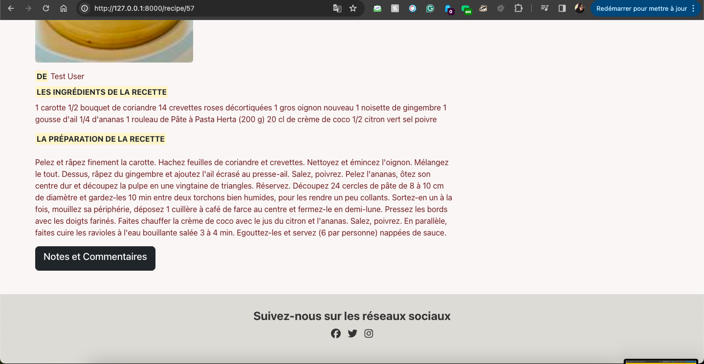

# Projet de Recettes avec Laravel

Ce projet a pour but de créer une plateforme permettant aux utilisateurs de trouver des recettes de cuisine. Réalisé avec le framework PHP Laravel, ce site offre une interface utilisateur simple pour naviguer parmi les recettes disponibles.

Le site sera composé de :

- **Une page d'accueil** affichant un texte de bienvenue et les 6
  dernières recettes
- **La page recettes**, qui affichent une liste de toutes les recettes, un lien pour voir des recettes de l'utilisateur, un lien pour déposer les recettes
- **La page d'une recette,** affichée après avoir été cliquée sur l'un d'eux dans la liste, le lien pour voir la note moyenne et les commentaires avec la possibilité d'ajouter la note et les commentaires
- **Une page de contact** avec un formulaire d'envoyer des messages
- Toutes les pages utilisent le même en-tête (header) et pied de page
  (footer).
- Le header contient un menu et barre de recherche.

## Guide d'installation

### Prérequis

- PHP >= 10.x
- Composer
- Node.js et npm

### Installation

1. Clonez le dépôt sur votre machine locale :

```bash
git clone git@github.com:tamipu/Application-web-framework-PHP-Laravel.git
```

2. Installez les dépendances Composer :

```bash
composer install
```
*Si Composer vous affiche des erreurs jaunes (Warnings), c'est que le
module php zip n'est pas activé. Ouvrez le fichier php.ini (Par exemple
`xampp/php/php.ini` pour Windows. Pour Linux, vous pouvez le chercher
avec which php) puis décommenter la ligne ;extension=zip (il faut juste
retirer le ; ), sauvegarde le fichier puis relancez l'installation de
Laravel*

3. Installez les dépendances npm et compilez les assets :

```bash
npm install
npm run dev
```

4. Copiez le fichier `.env.example` en `.env` et générez une clé d'application :

```bash
cp .env.example .env
php artisan key:generate
```

5. Configurez votre base de données dans le fichier `.env` puis migrez la base de données :

```bash
php artisan migrate
```

6. Base de données

*Utilisez une base SQLite plutôt que MySQL.*
phpliteadmin.php peut être accessible via "DBADMIN" sur le header de l'application.
*<http://127.0.0.1:8000/phpliteadmin.php>, le mot de passe est
admin*

<figure>

<figcaption>Figure 0: phpliteadmin</figcaption>
</figure>

7. Lancez le serveur de développement :

```bash
php artisan serve
```

Le site est maintenant accessible à l'adresse `http://127.0.0.1:8000`.

<figure>

<figcaption>Figure 1: Screen Home Page</figcaption>
</figure>

# Fonctionnalités implémentées

## CRUD des recettes

### 0. Affichage des recettes

- **Description** : Les utilisateurs peuvent visualiser les dernières recettes ajoutées sur la page d'accueil.
- **Test** : Visitez `http://127.0.0.1:8000` pour voir les 3 dernières recettes.

<figure>

<figcaption>Figure 2: Screen des recettes sur Home page</figcaption>
</figure>

### 1. Affichage d'une recette

- **Description** : Lorsqu'une recette est cliquée sur la page d'accueil ("Lire la suite") ou une recette dans la liste des recettes, on est redirigé vers la page du recipe spécifique. La recette affiche le nom du propriétaire, les infrédients, la contente, etc.
- **Test** : Visitez `http://127.0.0.1:8000/recipe/57` pour voir la recette id 57.

<figure>


<figcaption>Figure 3: Screen une recette spécifique</figcaption>
</figure>

### 2. Recherche de recettes

- **Description** : Implémentation d'une fonction de recherche pour trouver des recettes en fonction de leur tags.
- **Test** : Utilisez la barre de recherche sur la page d'accueil pour chercher une recette. Tapez par exemple "plat" ou "entree" pour voir les recettes correspondances.

<figure>

<figcaption>Figure 4: Screen résultat de la recherche des recettes</figcaption>
</figure>

### 3. Ajout de recettes

- **Description** : Les utilisateurs enregistrés peuvent ajouter de nouvelles recettes.
- **Test** : Cliquez sur le bouton "Déposer une recette" ou visitez `http://127.0.0.1:8000/recipes/create` pour ajouter une recette. Les champs qui ont les astérisk rouge (*) sont obligatoires donc vous ne pouvez pas "Enregistrer" si une des champs est vide.

<figure>


<figcaption>Figure 5: Screen de la formulaire d'ajouter d'une recette</figcaption>
</figure>

### 4. Modification d'une recette

- **Description** : Les utilisateurs peuvent modifier les recettes qu'ils ont ajoutées.
- **Test** : Sur `http://127.0.0.1:8000/recipe` vous devriez voir un bouton "Mes recettes". Vous pouvez modifier vos recettes en cliquant sur le bouton "Editer", ça vous envoie à `http://127.0.0.1:8000/admin/recipes/57/edit`

<figure>


<figcaption>Figure 6: Screen de la formulaire de modifier la recette</figcaption>
</figure>

### 5. Suppression d'une recette

- **Description** : Les utilisateurs peuvent supprimer les recettes qu'ils ont ajoutées.
- **Test** : A côté du bouton "Editer", vous pouvez supprimer vos recettes en cliquant sur le bouton "Supprimer".

<figure>

<figcaption>Figure 7: Screen des boutons pour supprimer et modifier la recette</figcaption>
</figure>

## CRUD des commentaires et la note

### 1. Affichage des commentaires

- **Description** : Les utilisateurs peuvent visualiser les commentaires associés à une recette en cliquant le bouton "Notes et Commentaires" sur la page de la recette spécifique.
- **Test** : Visitez `http://127.0.0.1:8000/comments/57` pour voir les commentaires associés à la recette avec l'ID 57.

<figure>

<figcaption>Figure 8: Screen des commentaires sur une recette spécifique</figcaption>
</figure>

### 2. Ajout de commentaires

- **Description** : Les utilisateurs enregistrés peuvent ajouter des commentaires sur les recettes.
- **Test** : Sur la page des commentaires de la recette spécifique, remplissez le formulaire de commentaire et cliquez sur "Envoyer". Le message d'ajouter avec succès va afficher au-dessous.

<figure>

<figcaption>Figure 9: Screen du formulaire d'ajout de commentaire</figcaption>
</figure>

### 3. Modification de commentaires

- **Description** : Les utilisateurs peuvent modifier les commentaires qu'ils ont ajoutés.
- **Test** : Accédez à votre commentaire et vous devriez voir un bouton pour modifier le commentaire au-dessous de la commentaire. Ça vous envoie à la formulaire pour la modifier `http://127.0.0.1:8000/comments/57/20/edit`. Après modifier, un message serait afficher pour marquer la succèss de l'action.

<figure>


<figcaption>Figure 10: Screen du formulaire de modifier de commentaire</figcaption>
</figure>

### 4. Suppression de commentaires

- **Description** : Les utilisateurs peuvent supprimer les commentaires qu'ils ont ajoutés.
- **Test** : Accédez à votre commentaire et vous devriez voir un bouton pour supprimer le commentaire en cliquant sur le bouton "Supprimer", un message serait afficher pour marquer la succèss de l'action.

<figure>

<figcaption>Figure 11: Screen du message de supprimer la commentaire avec succès</figcaption>
</figure>

### 5. Ajout de notes

- **Description** : Les utilisateurs enregistrés peuvent ajouter des notes aux recettes.
- **Test** : Sur la page des commentaires de la recette spécifique, remplissez le formulaire de note et cliquez sur "Noter". Le message d'ajouter de la note avec succès va afficher au-dessous. La note moyenne est calculée par rapport aux notes données.

<figure>

<figcaption>Figure 12: Screen de la note moyenne et du message d'ajouter la note avec succès</figcaption>
</figure>

## Gestion des tags

- **Description** : Les tags sont pour l’instant géré dans une colonne de tags sous forme de texte, cela permettra de pouvoir faire une recherche de recette par tags.
- **Test** : Vois la partie "Recherche de recettes".


## Formulaire de contact

- **Description** : Formulaire + enregistrement en base de données.
- **Test** : `http://127.0.0.1:8000/contact`, 

<figure>


<figcaption>Figure 13: Screen de la Formulaire de la contacte</figcaption>
</figure>

## Ajout de fichiers média pour les recettes

- **Description** : Pouvoir ajouter (uploader) l'image à un recette et qu’elle s’affiche ensuite sur le frontend. 

## Intégration graphique poussée 

- **Description** : Utiliser un framework bootstrap avec la thème graphique soigné. Possibilité de changer entre dark et light thème (et même de manière automatique selon les préférences utilisateurs).
- **Test** : Cliquez sur le bouton à droit de navbar pour changer la thème.

<figure>

<figcaption>Figure 14: Screen de la page avec le thème dark</figcaption>
</figure>

## Identification / Authentification qui protège l'accès à l’administration

- **Description** : Utiliser peut créer un compte et enregistrer leur donné dans la table de l'utilisateur. Le message de créer le compte avec succès va afficher au-dessus. 

<figure>


<figcaption>Figure 15: Screen de la page de créer un compte </figcaption>
</figure>

# Guide des Tests

## Liste des Tests

1. **Tests Unitaires (Unit Tests)**
   - **Test de la création de recette** : `php artisan test --filter RecipeTest`
   - **Test de validation des données de recette** : `php artisan test --filter RecipeValidationTest`
   - **Test de la modification de recette** : `php artisan test --filter RecipeUpdateTest`
   - **Test de la suppime de recette** : `php artisan test --filter RecipeDeleteTest`

2. **Tests Fonctionnels (Feature Tests)**
   - **Test de l'affichage des recettes sur la page d'accueil** : `php artisan test --filter RecipeIndexTest`

3. **Tests de Navigateur (Browser Tests utilisant Dusk)**
   - **Test de navigation sur la page d'accueil** : `php artisan dusk --group navigation`
   - **Test d'ajout de recette** : `php artisan dusk --group create-recipe`
   - **Test de modification de recette** : `php artisan dusk --group edit-recipe`

## Explications

- Les tests unitaires (Unit Tests) vérifient le bon fonctionnement des unités individuelles de code, comme les modèles, les contrôleurs, etc.
- Les tests fonctionnels (Feature Tests) vérifient le bon fonctionnement des fonctionnalités complètes de l'application, en simulant les interactions utilisateur.
- Les tests de navigateur (Browser Tests) utilisent Laravel Dusk pour tester les interactions utilisateur à travers un navigateur web réel.


