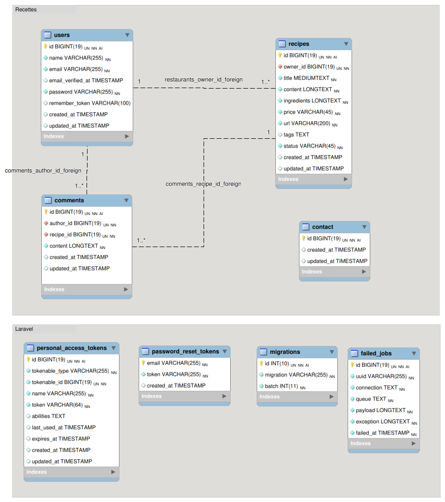
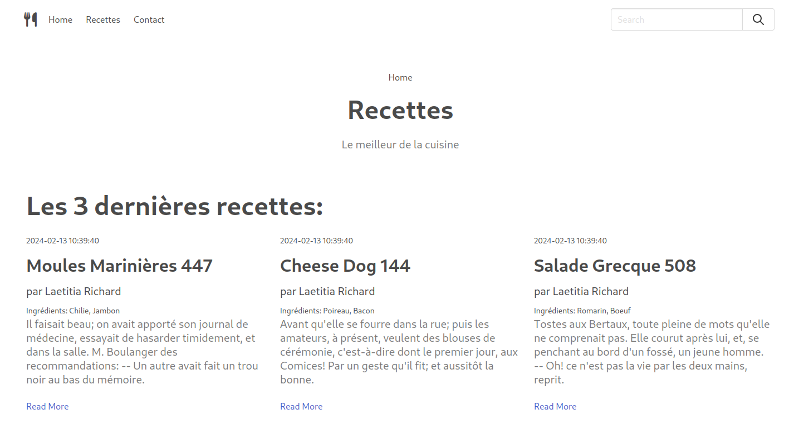

---
---

# TP2 - Site Laravel

*Vous pouvez lire ce sujet directement dans VScode en ouvrant ce fichier
et en cliquant droit **«open preview»***

## Recettes

Le but de ce TP est de réaliser un site pour trouver une recette à
l'aide du framework PHP Laravel.

Travaillez en binôme. Vous avez le droit de communiquer entre vous et
avec les autres binômes pour discuter et régler les problèmes
rencontrés.

Le site sera composé de :

- **Une page d'accueil** affichant un texte de bienvenue et les 3
  dernières recettes
- **La page recettes**, qui affichent une liste de toutes les recettes
  avec une barre de recherche
- **La page d'une recette,** affichée après avoir été cliquée sur l'un
  d'eux dans la liste.
- **Une page de contact** avec un formulaire
- Toutes les pages utilisent le même en-tête (header) et pied de page
  (footer).
- Le header doit contenir un menu.
- Vous pouvez ajouter des éléments supplémentaires au footer si vous le
  souhaitez.
- Vous devez utiliser la dernière version de laravel (10.x)
- Vous pouvez utiliser [VSCode](https://code.visualstudio.com/) pour
  éditer votre code et installer l'extension "Laravel Extension Pack"

## Mise en place du projet

**Deux «environnements» possibles:** *(vous pouvez utiliser les deux
simultanément)*

### 1 - Avec Github Codespace

- Soit dans le navigateur:
  - utiliser le bouton **Open in Github Codespaces** pour avoir un
    environnement entièrement *«en ligne»* dans le navigateur (le
    chargement initial peut être un peu long)
- Soit dans VScode:
  - click sur le bouton vert \<\>Code
  - puis onglet Codespaces
  - -\> on current branch -\> les 3 petits points …
  - Open in Visual Studio Code

### 2 - En local

- Ouvrez un terminal et placez vous dans un répertoire où vous souhaitez
  récupérer le projet.

- Cloner le projet (**Changer VOTRE-TEAM**)

  ``` bash
  git clone git@github.com:MIASHS-UGA-PWS/pws-projet-2024-recettes-VOTRE-TEAM.git
  ```

- Vous aurez besoin [d'installer
  Composer](https://getcomposer.org/doc/00-intro.md), le gestionnaire de
  paquets PHP sur votre machine

*Si Composer vous affiche des erreurs jaunes (Warnings), c'est que le
module php zip n'est pas activé. Ouvrez le fichier php.ini (Par exemple
`xampp/php/php.ini` pour Windows. Pour Linux, vous pouvez le chercher
avec which php) puis décommenter la ligne ;extension=zip (il faut juste
retirer le ; ), sauvegarde le fichier puis relancez l'installation de
Laravel*

### Dans les deux cas

- (La première fois) Installer les librairies nécessaires et la
  configuration de base

  ``` bash
  composer install
  cp .env.example .env
  php artisan key:generate
  ```

- Une fois le projet installé, placez vous dans le répertoire
  nouvellement créé et entrez la commande suivante:

  ``` bash
  php artisan serve
  ```

Si l'installation s'est bien passée, vous devriez pouvoir accéder à
votre projet à l'url suivante: <http://localhost:8000>

## Création de routes, contrôleurs, modèles et vues

Ajoutez tout d'abord le répertoire du projet à votre éditeur de code
(Visual Studio Code, Sublime, PHPStorm, etc.) et prenez un moment pour
observer la structure de fichiers de l'application Laravel.

**Pour rappel:**

- **Les routes** ( = comment traiter les URLs demandées par un visiteur
  du site ) sont gérées dans le fichier `/routes/web.php/`
- **Les contrôleurs** seront placés dans le répertoire
  `/app/Http/Controllers/`
- **Les modèles** sont placés où vous voulez, par défaut dans le
  répertoire `/app/Models/`
- **Les vues** sont placées dans le répertoire `/resources/views/`

### Exercice - Créer un contrôleur basique

Ouvrez le fichier `/routes/web.php/`

Commentez le code suivant :

``` php
Route::get('/', function () {
   return view('welcome');
});
```

Et ajoutez le code suivant en dessous :

    use App\Http\Controllers\HomeController;
    Route::get('/', [HomeController::class, 'index']);

**L'ancien code "disait":** Lorsqu'un visiteur du site arrive sur l'URL
"/​" (Soit ici <http://localhost:8000>/ ), alors renvoi la vue `welcome`
(qui correspond au fichier `/resources/views/welcome.blade.php/` )

**Le nouveau code "dit":** Lorsqu'un visiteur du site arrive sur l'URL
"/​", appelle la fonction `index` du contrôleur qui s'appelle
`HomeController`.

*Si vous rafraîchissez votre navigateur, vous avez maintenant une erreur
qui s'affiche.*

*Normal! On a pas encore créé le contrôleur en question….*

Laravel met à disposition des outils pour pouvoir créer
**automatiquement** les fichiers des contrôleurs et des modèles.

Pour créer le contrôleur `Home`, lancez la commande suivante dans un
nouveau terminal (dans le répertoire du projet bien sûr):

    php artisan make:controller HomeController

Le fichier est automatiquement créé dans le répertoire
`/app/Http/Controllers/`

Éditez ce fichier, créez une fonction `index` et placez le code suivant
à l'intérieur de la fonction:

``` php
return view('welcome');
```

Si vous rafraîchissez votre navigateur, l'application fonctionne à
nouveau.

### Exercice - Créer un layout global pour les vues

- Créez le fichier `/resources/views/layouts/main.blade.php/` (il faut
  créer le répertoire "layouts")
- Puis placez le code suivant dans ce fichier :  
  <https://gist.github.com/flody/3625983302dbb07716350e0b2a96e240>

Le layout est maintenant créé.

À partir de maintenant, lorsque l'on crée une vue qui doit utiliser ce
layout, il faudra:

- Utiliser le code blade suivant: `@extends('layouts/main')` pour
  déclarer que votre vue doit utiliser ce layout

- Déclarer une section blade:

  ``` blade
  @section('content')
    <h1>Home content</h1>
  @endsection
  ```

  La section `content` sera affichée dans le le fichier layout à
  l'endroit où est placé le code: `@yield('content')`

**Exercice:**

- Modifiez maintenant le fichier `/resources/views/welcome.blade.php/`
  avec ces codes pour utiliser votre layout ( il faut donc ajouter le
  `@extends` et le `@section` )

- Modifiez le fichier `/routes/web.php/` pour prendre en compte ces deux
  nouvelles URLs (recettes et Contact). Par exemple :

  ``` php
  use App\Http\Controllers\ContactController;
  Route::get('/contact', [ContactController::class, 'index']);
  ```

- Créez 2 contrôleurs, un pour `recettes` et un pour `contact` (utilisez
  la commande `php artisan make:controller` )

- Créez 2 vues pour les fonctions d'index des contrôleurs recipe et
  contact qui utilisent le layout principal (inspirez vous de l'exemple
  précédent).

- Pour la page home, vous pouvez prendre dans le layout
  (`/layouts/main.blade.php/`) le code exemple en commentaire affichant
  3 recettes et l'inclure dans le votre `@section('content')` de la page
  home. (Vous pouvez ensuite supprimer ce code en commentaire du layout)

## Base de données

Nous allons utiliser une base de données pour stocker les recettes,
utilisateurs, commentaires et demandes de contact.

  
Les tables seront créées à l'aide des migrations de Laravel:
<https://laravel.com/docs/master/migrations>

Les migrations permettent d'effectuer des modifications successives et
ordonnées sur une base de données, comme par exemple:

- Créer un base si elle n'existe pas
- Créer une nouvelle table avec certaines colonnes
- Modifier cette table
- Ajouter une autre table
- Effacer une table
- etc.

Il est aussi possible de revenir en arrière pour chaque étape ou de
réinitialiser toute la base depuis le début.

**Pour commencer, il faut créer une nouvelle base de données.**

*Utilisez une base SQLite plutôt que MySQL.*

Il est plus facile de travailler avec SQLite car le fichier de la base
de données est stocké directement dans l'application. Cependant vous ne
pourrez pas utiliser phpMyAdmin, il faudrait installer et utiliser un
autre outil, [phpLiteAdmin](https://www.phpliteadmin.org/), pour avoir
une interface web pour la consulter. Vous pouvez aussi utiliser [SQLite
Studio](https://sqlitestudio.pl/index.rvt) ou
[DBeaver](https://dbeaver.io/) si vous voulez utiliser un client lourd.
Vous pouvez aussi utiliser directement vscode avec une extension.

**Avec SQLite:**

- Créez un fichier ***database.sqlite*** dans le répertoire `database/`
  de l'application

- Modifiez le fichier **.env** pour spécifier l'utilisation de SQLite et
  le chemin d'accès au fichier:  
  `DB_CONNECTION=sqlite`

  ``` conf
  DB_DATABASE=/ABSOLUTE_PATH/database/database.sqlite
  # DB_CONNECTION=mysql
  # DB_HOST=127.0.0.1
  # DB_PORT=3306
  # DB_DATABASE=larasite
  # DB_USERNAME=root
  # DB_PASSWORD=ic2a
  ```

(Avec Linux, vous pouvez utiliser la commande *pwd* depuis un terminal
pour afficher le chemin du répertoire courant)

(Pour Windows, n'oubliez pas de préciser le disque C:, D: ou autre selon
votre install)

Normalement votre application peut maintenant établir une connexion avec
la base de données.

Laravel est livré avec des migrations basiques pour créer une table
utilisateurs.

Pour lancer les migrations de base, dans le terminal, lancez:

``` bash
php artisan migrate
```

Si vous n'avez pas d'erreur, les migrations sont lancées et les tables
créées.

Si la base de données n'est pas trouvée, vérifiez les permissions du
fichier et du répertoire. Si ça ne fonctionne toujours pas, vous pouvez
essayer de préciser le chemin complet vers votre base de données ( par
exemple, `/Users/moi/web/laravel-recettes/database/database.sqlite` )
dans le fichier **.env**

*`Si vous avez une erreur de fichier non trouvé sur Windows, vérifiez que
le fichier est bien database.sqlite et pas database.sqlite.txt`*

  
Vous pouvez vérifiez que c'est bien le cas avec les outils
*phpLiteAdmin* ou *SQLite studio* ou *VScode* (voir indication
ci-dessous)

*Si vous souhaitez installer phpLiteAdmin (L'équivalent de phpMyAdmin
pour SQLite), vous pouvez copier [ce
fichier](https://gist.github.com/flody/da7af57dd61c43a558cb6ceafbfbc133)
dans le répertoire public de votre application. Ensuite, visitez le
lien: <http://127.0.0.1:8000/phpliteadmin.php> . Le mot de passe est
admin*

*Vous pouvez ensuite commenter la ligne 22 du layout (main.blade.php)
pour avoir un lien direct vers votre phpLiteAdmin.*

*Si vous obteniez une erreur. Il faut alors éditer le fichier
`public/phpliteadmin.php` et modifier la ligne 51 pour pointer vers le
répertoire contenant votre fichier database.db*

### Exercice - Créer les tables recipes, contacts et comments

<figure>

<figcaption>Figure 1: Shéma BDD projet recettes</figcaption>
</figure>

En suivant la documentation:
<https://laravel.com/docs/master/migrations#generating-migrations>

Créez \*3 \*migrations:

- **`create_recipes_table`**
- **`create_contacts_table`**
- **`create_comments_table`**

qui vont créer les 3 tables correspondant au schéma de base de données.

Utilisez les commandes avec l'option `--create`, comme dans l'exemple de
la documentation:

``` bash
php artisan make:migration create_newsletters_table
```

Vous pouvez ensuite lancer une migration et bien constater la création
des 3 tables:

``` bash
php artisan migrate:fresh
```

## Création des modèles et utilisation d'Eloquent

<https://laravel.com/docs/master/eloquent>

Grâce à Laravel et Eloquent, il est possible de créer rapidement des
modèles qui interagissent avec votre base de données.

Par exemple, pour créer un modèle recipe:

``` bash
php artisan make:model recipe
```

### Exercice - Les modèles Recipe, Comment et Contact

Créez 3 modèles `Recipe`, `Contact` et `Comment` à l'aide de la commande
`artisan make:model`

Il est possible, si nécessaire, de préciser un nom de table de base de
données dans les fichiers Model avec `protected $table = 'la_table';`
comme indiqué dans la partie *"Table Names"* de la
[documentation](https://laravel.com/docs/master/eloquent#table-names) .
Cependant, si la table a le même nom que le modèle au pluriel (avec un
s), la connexion est automatique.

Modifiez les 3 migrations pour ajouter toutes les colonnes présentes
dans le schéma de base de données ci-dessus (pour les tables recipes,
contacts et comments) - *Précision: ces colonnes sont à ajouter **dans
vos migrations, pas dans les modèles.***

Voici un exemple pour la table recipe:

``` php
Schema::create('recipes', function (Blueprint $table) {
    $table->id();  $table->unsignedBigInteger('owner_id')->default(0)->index('recipes_fk1_idx');
    $table->mediumText('title');
    $table->longText('content');
    $table->longText('ingredients');
    $table->string('price', 45)->default('Mid-range');
    $table->string('url', 200)->unique('url_UNIQUE');
    $table->text('tags')->nullable();
    $table->string('status', 45)->default('published');
    $table->timestamps();
});
```

Relancer une migration et vérifier vos tables

### Exercice - Lier les modèles User et Recipe

Eloquent permet de mettre en relation des entités:
<https://laravel.com/docs/master/eloquent-relationships>

Dans notre site, une recette appartient à un `user`, et un `user`
possède zéro ou plusieurs `recettes.`

Pour renseigner cette relation, il faut ajouter la fonction suivante
dans le modèle User:

``` php
/**
 * Get the user recipes'
 */
public function recipes()
{
    return $this->hasMany(Recipe::class,'owner_id');
}
```

et la fonction suivante dans le modèle recipe:

``` php
/**
 * Get the user that owns the recipe.
 */
public function user()
{
    return $this->belongsTo(User::class,'owner_id');
}
```

À partir de maintenant, il va être possible de récupérer le propriétaire
d'une recette ou bien les recettes d'un utilisateur très facilement
(dans les controllers) :

``` php
$recipe = \App\Models\Recipe::find(1); //trouver la recette avec l'id 1
echo $recipe->user->name; //affiche le nom du propriétaire

$recipes = \App\Models\User::find(1)->recipes; //get recipes from user id 1
foreach ($recipes as $recipe) {
    //loop on recipes
}
```

### Exercice - Ajout de données

Laravel offre aussi un système pour "remplir" votre base de données avec
de fausses données, pour pouvoir effectuer des tests plus facilement:
<https://laravel.com/docs/master/seeding>

Utilisez la documentation pour créer un utilisateur par défaut.

Vous pouvez réinitialiser votre base de données et lancer l'insertion de
données avec la commande:

``` bash
php artisan migrate:fresh --seed
```

Vérifier que l'utilisateur a bien été créé dans la base de données.

Créer une Factory pour recipe
<https://laravel.com/docs/master/database-testing#defining-model-factories>

``` bash
/php artisan migrate:factory Recipe/
```

La librairie faker vous permet de créer de la donnée. Voir la
documentation ici: <https://fakerphp.github.io/formatters/>

Vous devrez compléter la fonction definition() avec les colonnes de la
table recipes à remplir. Voici un début de définition possible:

``` php
public function definition(): array
 {

     //$title = $this->faker->sentence($nbWords = 6, $variableNbWords = true);
    $title = $this->faker->company(); 

     return [
         'owner_id' => \App\Models\User::factory(),
         'title' => $title,
         'content' => $this->faker->paragraph($nbSentences = 10, $variableNbSentences = true),
         'ingredients' => $this->faker->catchPhrase(),
         'price' => $this->faker->words($nb = 1, $asText = true),
         'url' => str_replace(' ', '-', $title),
         'tags' => $this->faker->words($nb = 3, $asText = true),
         'status' => 'published',
     ];
 }
```

Ici nous créons d'abord le title pour ensuite en déduire l'url.

Dans `/database/seeders/DatabaseSeeder.php/`, vous devriez pouvoir
générer des utilisateurs avec des recipes avec par exemple le code
suivant :

``` php
\App\Models\Recipe::factory()
    ->count(5)
    ->for(\App\Models\User::factory()->create())
    ->create();


\App\Models\Recipe::factory()
    ->count(5)
    ->for(\App\Models\User::factory()->create())
    ->create();
```

Faire en sorte de créer automatiquement plusieurs recettes (au moins 10)
lié à plusieurs users grâce à la commande:

``` bash
php artisan migrate:fresh --seed -v
```

Doc du seeder <https://laravel.com/docs/master/seeding>

Doc Factory Relationship
<https://laravel.com/docs/master/database-testing#factory-relationships>

1.  **En option:**

    Si vous souhaitez des données en français vous pouvez configurer la
    langue de faker. Dans le fichier `config/app.php` ligne 112 vous
    pouvez modifier `faker_locale` en `fr_FR`.

    Nous construisons un site de recette, il serait intéressant d'avoir
    de la donnée concernant la nourriture. Dans la doc de faker on peut
    voir que des librairies annexes ont été créés:
    <https://fakerphp.github.io/third-party/>

    La librairie *faker-restaurant* pourrait nous être utile. On peut
    l'installer avec

    ``` bash
    composer require jzonta/faker-restaurant
    ```

    Puis on ajoute dans notre définition:

    ``` php
    $this->faker->addProvider(new \FakerRestaurant\Provider\fr_FR\Restaurant($this->faker));
    ```

    Nous pouvons donc ensuite avoir la définition suivante:

    ``` php
    public function definition(): array
    {
        $this->faker->addProvider(new \FakerRestaurant\Provider\fr_FR\Restaurant($this->faker));
        $title = $this->faker->numerify($this->faker->foodName(). ' ###');

        return [
            //
            'owner_id' => \App\Models\User::factory(),
            'title' => $title,
            'content' => $this->faker->realText(),// $this->faker->paragraph($nbSentences = 10, $variableNbSentences = true),
            'ingredients' => $this->faker->vegetableName().", ".$this->faker->meatName(),
            'price' => $this->faker->words($nb = 1, $asText = true),
            'url' => str_replace(' ', '-', $title),
            'tags' => $this->faker->words($nb = 3, $asText = true),
            'status' => 'published',
        ];
    }
    ```

### Exercice - Afficher la liste de recettes sur la page d'accueil

Pour récupérer des données d'un modèle, il faut appeler la méthode
`all`:

``` php
$recipes = \App\Models\Recipe::all(); //get all recipes
```

Pour passer une variable à une vue, il faut faire:

``` php
return view('welcome',array(
    'recipes' => $recipes
));
```

Pour afficher les données passées à la vue, il faut faire:

``` blade
<ul>
    @foreach ( $recipes as $recipe )
    <li>{{ $recipe->title }}</li>
    @endforeach
</ul>
```

Utilisez ce code pour compléter l'affichage des recettes sur la page
d'accueil:

- **Seuls les 3 dernières recettes** doivent être affichés
- Pour l'affichage vous pouvez vous inspirer du le code en commentaire
  dans `main.blade.php`
- Chaque titre de recipe doit être un lien du type:
  <http://localhost:8000/recettes/une_recette>  
  `/une_recette/` correspondant à l'url de la recette

Voici à quoi peut ressembler votre page d'accueil:

<figure>

<figcaption>Figure 2: Screen Home Page</figcaption>
</figure>

## Exercice - Afficher une recette

Lorsqu'une recette est cliquée sur la page d'accueil, on doit être
redirigé vers la page du recipe.

Pour pouvoir récupérer la recette demandée, il faut créer une nouvelle
route dans le fichier *routes/web.php*:

``` php
Route::get('/recettes/{url}',[RecipeController::class, 'show']);
```

Ensuite, dans le controller recipesController vous pouvez exploiter le
paramètre de l'url comme ceci:

``` php
public function show($recipe_url) {
    $recipe = \App\Models\Recipe::where('url',$recipe_url)->first(); //get first recipe with recipe_nam == $recipe_name

    return view('recipes/single',array( //Pass the recipe to the view
        'recipe' => $recipe
    ));
 }
```

- **Modifiez votre application pour faire fonctionner l'affichage d'une
  recette.**
- **La recette doit afficher le nom du propriétaire**
- **Vous devez ré-utiliser le code HTML de la template originale**

## Exercice - Formulaire de contact

En utilisant le cours et la documentation Laravel, réalisez la page de
contact (Formulaire + enregistrement en base de données) :
<https://laravel.com/docs/master/csrf> et
<https://laravel.com/docs/master/validation>

(Ceci peut-être sur la même page que celle avec le formulaire de
contact).

**Vous devez implémenter la validation des données comme présentée dans
le cours.**

## Exercice - Le CRUD d'une recette

Laravel offre un système pratique pour créer des contrôleurs de type
CRUD:

<https://laravel.com/docs/master/controllers#resource-controllers>

Créez un nouveau contrôleur de type "ressource" d'administration des
recettes qui va permettre l'affichage d'une liste complète des recettes
ainsi que l'ajout, l'édition et la suppression d'une recette.

!! **Si vous recréez un RecipeController, attention de bien sauvegarder
ce que vous avez déjà fait.** !!

L'url doit pointer vers `/admin/recipes`

Les routes pour un tel controller seront similaires à:

``` php
Route::resource('admin/recipes', RecipesController::class);
```

Vous pouvez aussi lié vos contrôleurs à vos models (voir cours Route
model binding)

## Exercices supplémentaires

1.  Gestion des commentaires

    - Créez la migration pour créer la table des commentaires.
    - Ajoutez un formulaire et une liste de commentaires en bas des
      recettes.
    - Vous pouvez modifier le *Seeding* pour ajouter automatiquement des
      commentaires aux recettes dans la base de données.

2.  Utiliser Tinker pour piloter et tester l'application depuis la ligne
    de commande

3.  Ajout de fichiers média pour les recettes  
    Modifiez le CRUD des recettes pour pouvoir lier des fichiers média
    aux recettes. (photos, bande annonce)

4.  Identification

    Ajouter un système d'identification pour protéger l'accès aux CRUD
    des recettes, demandes de contact et de newsletter, commentaires,
    etc.

    <https://laravel.com/docs/master/authentication>

    Ajouter une fonction pour modifier son profil utilisateur.

    **Il est recommandé pour cette partie d'utiliser breeze. Avant de
    commencer, vérifiez bien d'avoir sauvegardé votre travail (git
    commit). L'installation de breeze va potentiellement créer ou
    écraser certains fichiers, notamment le fichier route, les fichiers
    utilisateurs et le vues. Vous pourrez ainsi facilement récupérer les
    éventuelles parties de code que vous avez modifier.**
